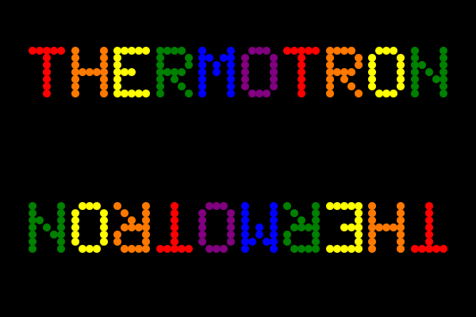
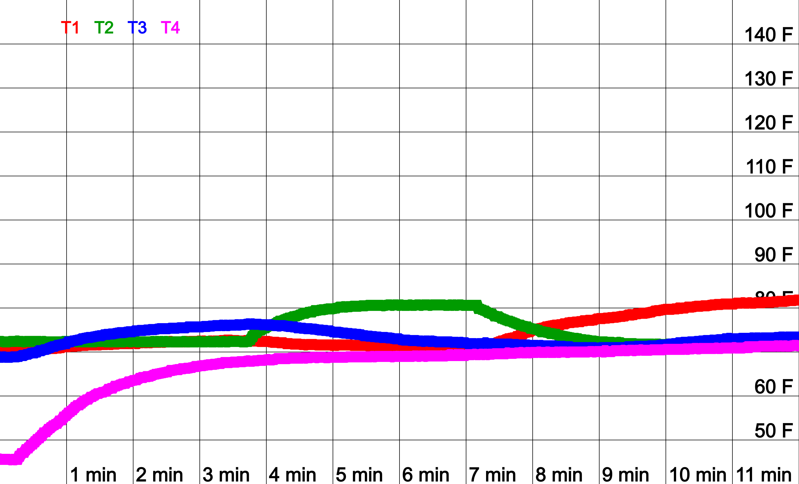
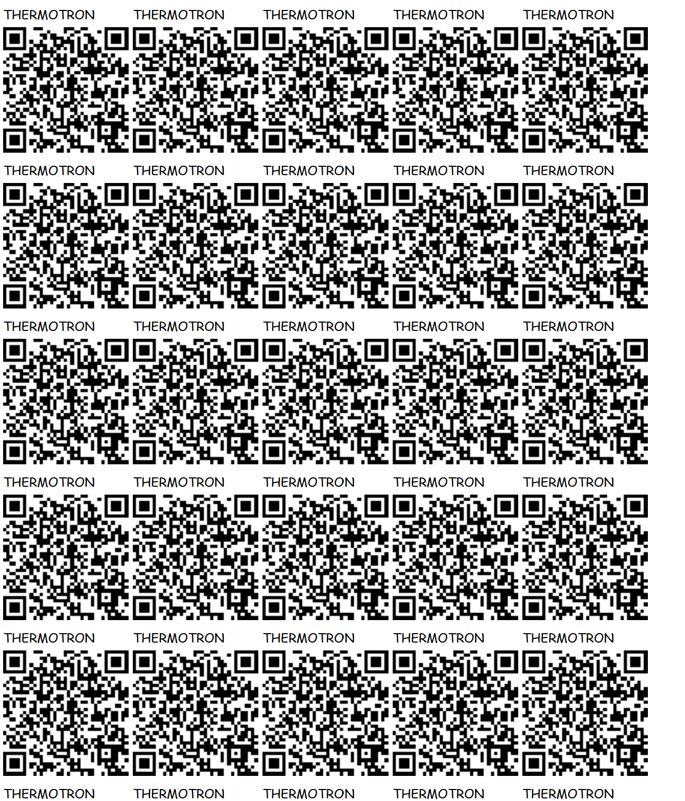
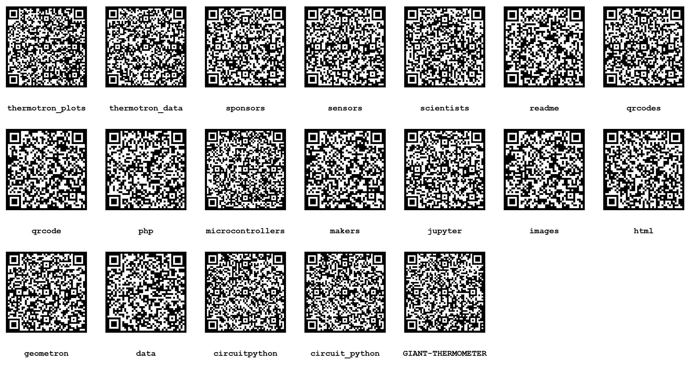

# [THERMOTRON](https://github.com/lafelabs/thermotron)

A free thermometer for all the people!

 - [Thermomotron live plot](https://colfax.site/thermotron/)
 - [Thermotron Network](network/)
 - [Thermotron Makers](makers/)
 - [Thermotron Scientists](scientists/)
 - [Thermotron Magicians](magicians/)
 - [Thermotron Gardeners](gardeners/)
 - [Thermotron Web Devs](webdevs/)
 - [Thermotron Web Hosts](webhosts/)
 - [Thermotron Feather from Adafruit](feather/)
 - [Thermotron Sensors from Adafruit](sensors/)
 - [Thermotron Wires from Adafruit](wires/)
 - [Thermotron QR Codes](qrcode/)
 - [Thermotron Jupyter](jupyter/)
 - [Thermotron Thermodynamics](thermodynamics/)
 - [Thermotron Tarot](tarot/)
 - [Thermotron Brand](brand/)
 - [Thermotron CircuitPython](circuitpython/)

[](thermotron.html)

[](thermotron.html)

[](thermotron.html)

[](plots.html)





[](https://www.adafruit.com/product/5300)

[](https://www.adafruit.com/product/5027)

[](https://www.adafruit.com/product/5027)

[](https://www.adafruit.com/product/5027)

[](https://www.adafruit.com/product/5027)


### [code.py](https://github.com/LafeLabs/thermotron/blob/main/circuit_python/code.py)


## BOM(Bill Of Materials)

 - [1x $24.95 Adafruit ESP32-S2 TFT Feather - 4MB Flash, 2MB PSRAM, STEMMA QT](https://www.adafruit.com/product/5300)
 - [4x $4.95 Adafruit MCP9808 High Accuracy I2C Temperature Sensor Breakout - STEMMA QT / Qwiic](https://www.adafruit.com/product/5027)
 - [1x $4.95 Adafruit USB Type A to Type C Cable - approx 1 meter / 3 ft long](https://www.adafruit.com/product/4474)
 - [4x $1.13 STEMMA QT / Qwiic JST SH 4-Pin Cable - 200mm Long](https://www.adafruit.com/product/4401)

## PYTHON CODE 

### [code.py](https://github.com/LafeLabs/thermotron/blob/main/circuit_python/code.py)

```
# SPDX-FileCopyrightText: 2018 Kattni Rembor for Adafruit Industries
#
# SPDX-License-Identifier: MIT

import time
import board
import digitalio
import adafruit_mcp9808
import usb_hid
from adafruit_hid.keyboard import Keyboard
from adafruit_hid.keyboard_layout_us import KeyboardLayoutUS
from adafruit_hid.keycode import Keycode

button_start_stop = digitalio.DigitalInOut(board.BUTTON)
button_start_stop.direction = digitalio.Direction.INPUT
button_start_stop.pull = digitalio.Pull.UP

#i2c = board.I2C()  # uses board.SCL and board.SDA
i2c = board.STEMMA_I2C()  # For using the built-in STEMMA QT connector on a microcontroller

# To initialise using the default address:
#mcp = adafruit_mcp9808.MCP9808(i2c)

# To initialise using a specified address:
# Necessary when, for example, connecting A0 to VDD to make address=0x19
mcp = adafruit_mcp9808.MCP9808(i2c, address=0x18)
mcp0 = adafruit_mcp9808.MCP9808(i2c, address=0x19) 
mcp1 = adafruit_mcp9808.MCP9808(i2c, address=0x1A)
mcp2 = adafruit_mcp9808.MCP9808(i2c, address=0x1C)

running = False
# The keyboard object!
time.sleep(1)  # Sleep for a bit to avoid a race condition on some systems
keyboard = Keyboard(usb_hid.devices)
keyboard_layout = KeyboardLayoutUS(keyboard)  # We're in the US :)


while True:
#    print(not(button_start_stop.value))
 #   print(not(button_unit_select.value))
    if not(button_start_stop.value):
        running = not(running)
        if not(running):
            print("STOP")
        else:
            print("START")
        time.sleep(0.1)
    T1C = mcp.temperature
    T1F = T1C * 9 / 5 + 32
    T2C = mcp0.temperature
    T2F = T2C * 9 / 5 + 32
    T3C = mcp1.temperature
    T3F = T3C * 9 / 5 + 32
    T4C = mcp2.temperature
    T4F = T4C * 9 / 5 + 32
    if running:
        print("[{},{},{},{}] F\n[{},{},{},{}] C".format(T1F, T2F, T3F, T4F, T1C, T2C, T3C, T4C))
        keyboard_layout.write("[{},{},{},{}] F\n[{},{},{},{}] C\n".format(T1F, T2F, T3F, T4F, T1C, T2C, T3C, T4C))
    time.sleep(1)


```
