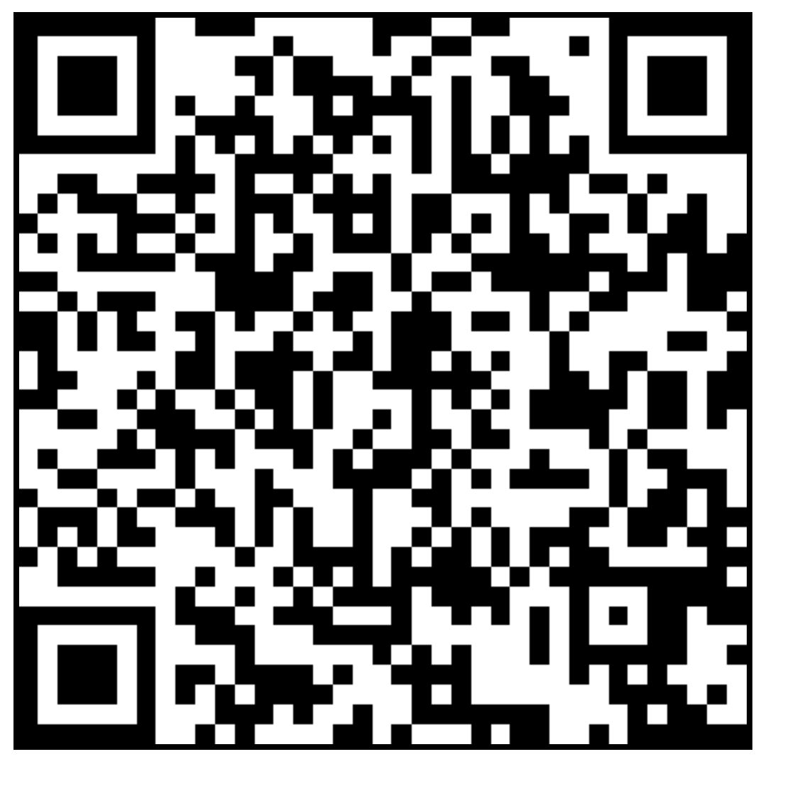

# [THERMOTRON](https://github.com/lafelabs/thermotron)

## TALE

I am an applied physicists by trade and by training, and I go by Trash Robot on the Internet. The THERMOTRON is a free hardware implementation of a project I was paid to work on while working at the Johns Hopkins University Applied Physics Laboratory in suburban Maryland, half way between DC and Baltimore.  We had a complex system of pipes and tubes and needed to log temperatures at various points around the system.  This is the sort of task that is supposed to be "easy".  All you have to do is buy stuff and it "just works".  But what system? And how will it log?  How will it talk to your existing systems? How do you make the trade offs between cost and accuracy?

What I concluded was that I2C sensors from [Adafruit](https://adafrut.com) would be the easiest way to do this, with the best trade off of accuracy vs. cost, as well as removing a bunch of the cost associated with engineering that the user has to do to make a real system. 

To avoid soldering, we use the Qwiic Connect System from Sparkfun.  This is also something I plan to now adopt in all other projects I'm working on, including cryogenic.  

This is a project that got abandoned by me when I quit my old job, and then also abandoned internally for various reasons. But now, I've found myself talking with both compost enthusiasts and people fixing solar vehicles, where temperature matters in the range of room temperature, from below freezing up to as high as 200 F.  

Looking at advances in the hardware on Adafruit, especially how they have built in displays, run circuit python, have the connectors I need, and can emulate a keyboard, I decided to go with the FeatherWing to try out temperature readouts with that instead of Arduino.  

The plan here is to program the FeatherWing to read out all the thermometers, and then scroll them in a display on the screen, and also to *type* them as a keyboard emulated piece of hardware, so that the system can input data as text. 

Once we have a system that can behave like a keyboard, anyone can simply dump the output of that stream of keystrokes into a text file.  But also, that sequence can include carriage returns and control characters of all kinds, allowing it to fully interact with any kind of software with a keyboard input.   This will allow us to integrate the devices into the Trash Magic system of web-based applications as well as the decentralized social media networks of the Fediverse.  

We will specify a standard JSON format here in this self-replicating document which anyone copying the system can use to publish data over the Fediverse.  We can build formats on top of this for metadata which include latitude and longitude, altitude, stories of where the data came from, what it's for, what it means, what you can do with it, images, urls, contact info of creators and so on.  And then people can join together to build software which aggregates these data sets, plots them, analyzes them, and then releases the product of that analysis back out onto the federated science networks.  

This is thermometry as social media!

## LORE

 - [The Qwiic Connect System from Sparkfun](https://www.sparkfun.com/qwiic)
 - [SparkFun Qwiic Cable Kit](https://www.sparkfun.com/products/15081)
 - [SparkFun Temperature Sensor - STTS22H (Qwiic)](https://www.sparkfun.com/products/21262)
 - [Adafruit ESP32-S2 TFT Feather - 4MB Flash, 2MB PSRAM, STEMMA QT](https://www.adafruit.com/product/5300)
 - [Adafruit MCP9808 High Accuracy I2C Temperature Sensor Breakout - STEMMA QT / Qwiic](https://www.adafruit.com/product/5027)

 - [EDITOR.PHP](editor.php)